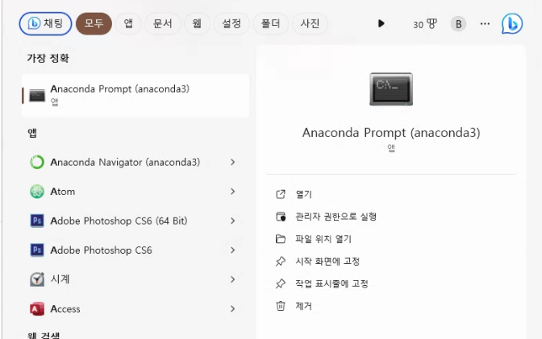

# Multi Modal(Face, Body) Data Extract Module

**피험자의 `Body Pose`, `Face Pose`, `Facial emotion recogntion` 값을 추출하는 프로그램**

#### 가상 환경 구축

1. **Anaconda 설치**
   
   - [Anaconda 홈페이지]([Free Download | Anaconda](https://www.anaconda.com/download#Downloads)) 방문해서 **Download** 버튼 클릭
   
   

2. **Anaconda Prompt 실행**
   
   

3. **가상환경 생성 및 접속**
   
   - Python은 **3.10버전**으로 지정하여 가상환경을 생성한다. 
     
     >  <u>MediaPipe : version 3.8 - 3.11을 지원하기 때문에 해당 버전 내에서만 가능</u>
   
   ```bash
   > conda create --name <가상환경이름> python=3.10
   ```
   
   - 생성이 완료 되었다면, 가상환경을 **활성화**해준다.
   
   ```bash
   > conda activate <가상환경이름>
   ```

4. **Software 환경 구축**
   
   - **`requirement.txt`** 파일이 있는 디렉토리 내에서 아래와 같은 명령어로 **패키지를 설치한다.**
   
   ```bash
   ~\MultiModalData> pip install -r requirement.txt
   ```

---

#### 📌 Body Pose 데이터 추출

**[데이터셋 위치]** : **dataset/body** 폴더 내 비디오 파일이 있으면 됩니다.

**[결과파일 위치]** : 

- `좌표 데이터 파일(excel)` : **results/body** 폴더 내 

- `landmark된 영상 파일(video)` : **dataset/body** 폴더 내

 

**[실행 순서]**

1. **`pose_landmarker.py`** 파일이 존재하는 디렉토리로 이동
   
   ```bash
   ~\MultiModalData> cd body
   ```
   
   

2. **`pose_landmarker.py`** 실행 
- (⭐**parameter 설정 방법.txt** 은 추천하는 Parameter 값이 적힌 파일⭐)
  
  ```bash
  ~\MultiModalData\body> python pose_landmarker.py -clip_name ..\dataset\body\<video clip name>
  ```


**[Option 설명]**

- `-clip_name` :  비디오 파일 이름 (ex - `-clip_name ..\dataset\body\body_test.mp4`) **⭐필수 입력⭐**

- `-num_poses` : 최대 인식할 Pose 수 (ex - `-num_poses 1`) 
  
  > **default 값 : 2**

- `-min_pose_detection_confidence` : 포즈 감지의 성공을 간주하기 위한 최소 신뢰도 점수 (ex - `-min_pose_detection_confidence 0.4`)
  
  > **default 값 : 0.4**

- `-min_pose_presence_confidence` : 포즈 랜드마크 감지에서 포즈 존재 점수의 최소 신뢰도 점수 (ex - `-min_pose_presence_confidence 0.4`)
  
  > **default 값 : 0.2**

- `-min_tracking_confidence` : 성공적인 포즈 추적을 간주하기 위한 최소 신뢰도 점수 (ex - `-min_tracking_confidence 0.4`)
  
  > **default 값 : 0.3**
  
  

#### 📌 Face Pose 데이터 추출

**[데이터셋 위치]** : **dataset/face** 폴더 내 비디오 파일이 있으면 됩니다.

**[결과파일 위치]** :

- `좌표 데이터 파일(excel)` : **results/face** 폴더 내

- `landmark된 영상 파일(video)` : **dataset/face** 폴더 내


**[실행 순서]**

1. **`face_landmarker.py`** 파일이 존재하는 디렉토리로 이동
   
   ```bash
   ~\MultiModalData> cd face
   ```

2. **`face_landmarker.py`** 실행
- (⭐**parameter 설정 방법.txt** 은 추천하는 Parameter 값이 적힌 파일⭐)
  
  ```bash
  ~\MultiModalData\face> python face_landmarker.py -clip_name ..\dataset\face\<video clip name>
  ```

**[Option 설명]**

- `-clip_name` : 비디오 파일 이름 (ex - `-clip_name ..\dataset\face\face_test.mp4`) **⭐필수 입력⭐**


#### 📌 Facial emotion recogntion 데이터 추출

**[데이터셋 위치]** : **dataset/face** 폴더 내 비디오 파일이 있으면 됩니다.

**[결과파일 위치]** :

- `예측값 데이터 파일(excel)` : **results/face__emotion** 폴더 내


**[실행 순서]**

1. **`face_landmarker.py`** 파일이 존재하는 디렉토리로 이동
   
   ```bash
   ~\MultiModalData> cd face_emotion
   ```

2. **`face_landmarker.py`** 실행
- (⭐**parameter 설정 방법.txt** 은 추천하는 Parameter 값이 적힌 파일⭐)
  
  ```bash
  ~\MultiModalData\face_emotion> python face_emotion_classifier.py -clip_name ..\dataset\face\<video clip name>
  ```

**[Option 설명]**

- `-clip_name` : 비디오 파일 이름 (ex - `-clip_name ..\dataset\face\face_test.mp4`) **⭐필수 입력⭐**


